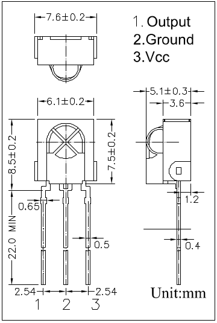

<div align="center">
   <h1>
      IR Controlled RGB LED
   </h1>
   <p align="center">
      Yeah pretty straight forward, an LED that changes color when you push buttons on a remote.
   </p>
   
</div>

## How it works

An IR (InfraRed) remote works by turning an LED on and off in unique patterns.
These patterns yield unique codes.
Each key on the remote sends a different code.
These codes are different for every remote, so to see which codes your remote sends you can compile and upload the `src/ir-remote-codes/ir-remote-codes.ino` file to your Arduino.

To make the Arduino understand which key has been pressed, we can use an IR receiver module combined with it's needed library (in the code `IRremote.h`).
Once the Arduino knows which keys are sending which code, we can assign different colors to each key so that we can control the color of the RGB LED.

To compile and upload the code to the Arduino you can do the following.

**NOTE**: The commands below assume you are using an Arduino UNO. Refer to the [docs](https://arduino.github.io/arduino-cli/0.27/getting-started/) for more information.

```
$ cd src/                                                                      # Navigate inside the source directory
$ arduino-cli compile --fqbn arduino:avr:uno ir-controlled-rgb                 # Compile the code
$ arduino-cli upload -p /dev/ttyACM0 --fqbn arduino:avr:uno ir-controlled-rgb  # Upload the compiled code to the Arduino UNO
```

**NOTE**: don't forget to update the permissions of `/dev/ttyACM0` (`sudo chmod a+rw /dev/ttyACM0`).

## Problem(s) I encountered

I don't know exactly, but for some reason the IR library caused the `analogWrite` method to stop working properly from time to time.
The problem especially occured when the RGB value did not contain `255`, `0`, or `125`.
This caused the program to deadlock itself when you press a button on the remote, after a bit of testing and rewiring the electrical circuit seems to have fixed the problem.
Although I'm still not entirely sure what caused this issue.

## Electrical scheme


| IR Receiver Connections      | RGB LED Connections              |
| ---------------------------- | -------------------------------- |
|  |  |

